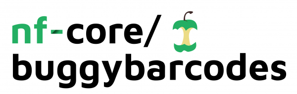

# 

**16S Amplicon Sequencing Data Analysis Pipeline**.

[](https://github.com/nf-core/buggybarcodes/actions)
[](https://github.com/nf-core/buggybarcodes/actions)
[](https://www.nextflow.io/)

[](https://bioconda.github.io/)
[](https://hub.docker.com/r/nfcore/buggybarcodes)
[](https://nfcore.slack.com/channels/buggybarcodes)

## Introduction

**nf-core/buggybarcodes** is a bioinformatics analysis pipeline for 16S amplicon sequencing data that using the QIIME2 platform. This pipeline takes Illumina fastq files as input, performs adapter & primer trimming, read merging, quality trimming, deblur feature identification and taxonomic classification of features using a Naive Bayes Classifer trained on the SILVA 138 release.

The pipeline is built using [Nextflow](https://www.nextflow.io), a workflow tool to run tasks across multiple compute infrastructures in a very portable manner. It comes with docker containers making installation trivial and results highly reproducible.

## Quick Start

1. Install [`Nextflow`](https://nf-co.re/usage/installation) (`>=20.04.0`)

2. Install any of [`Docker`](https://docs.docker.com/engine/installation/), [`Singularity`](https://www.sylabs.io/guides/3.0/user-guide/), [`Podman`](https://podman.io/), [`Shifter`](https://nersc.gitlab.io/development/shifter/how-to-use/) or [`Charliecloud`](https://hpc.github.io/charliecloud/) for full pipeline reproducibility _(please only use [`Conda`](https://conda.io/miniconda.html) as a last resort; see [docs](https://nf-co.re/usage/configuration#basic-configuration-profiles))_

3. Download the pipeline and test it on a minimal dataset with a single command:

    *  **Please Note** Before running the pipeline you will need to download the naive bayes classifier. This is made available by the QIMME2 developers [here](https://docs.qiime2.org/2019.10/data-resources/)

    ```bash
    # Download the SILVA classifier
    wget https://data.qiime2.org/2021.2/common/silva-138-99-515-806-nb-classifier.qza

    # test pipeline to ensure it is working
    nextflow run nf-core/buggybarcodes -profile test,<docker/singularity/conda/institute>
    ```

    * Please check [nf-core/configs](https://github.com/nf-core/configs#documentation) to see if a custom config file to run nf-core pipelines already exists for your Institute. If so, you can simply use `-profile <institute>` in your command. This will enable either `docker` or `singularity` and set the appropriate execution settings for your local compute environment.

    * **Note** For NIBSC HPC users, Franceso has created a `nibsc` profile for executing nextflow pipelines. This can be implemented using `-profile nibsc` at the command line.

    *  If you are using singularity then the pipeline will auto-detect this and attempt to download the Singularity images directly as opposed to performing a conversion from Docker images. If you are persistently observing issues downloading Singularity images directly due to timeout or network issues then please use the `--singularity_pull_docker_container` parameter to pull and convert the Docker image instead. Alternatively, it is highly recommended to use the nf-core download command to pre-download all of the required containers before running the pipeline and to set the `NXF_SINGULARITY_CACHEDIR` or `singularity.cacheDir` Nextflow options to be able to store and re-use the images from a central location for future pipeline runs.

4. Start running your own analysis!

> Typical command using preset parameters

    ```bash
    nextflow run nf-core/buggybarcodes -profile <docker/singularity/conda/institute>  <--input_dir/--input_manifest '/FULL/PATH/TO/DATA'> --classifier '/FULL/PATH/TO/DOWNLOADED/CLASSIFIER' --metadata '/FULL/PATH/TO/METADATA'
    ```

> It is also possible to alter pipeline parameters (adapter sequences, filtering thresholds etc)

    ```bash
    nextflow run nf-core/buggybarcodes -profile <docker/singularity/conda/institute>  <--input_dir/--input_manifest '/FULL/PATH/TO/DATA'> --classifier '/FULL/PATH/TO/DOWNLOADED/CLASSIFIER' --metadata '/FULL/PATH/TO/METADATA' --forward_primer 'GTGYCAGCMGCCGCGGTAA...ATTAGAWACCCBNGTAGTCC' --reverse_primer 'GGACTACNVGGGTWTCTAAT...TTACCGCGGCKGCTGRCAC' --abundance 0.00005
    ```

See [usage docs](https://github.com/nibscbioinformatics/nf-core-buggybarcodes/blob/dev/docs/usage.md) for all of the available options when running the pipeline.

## Pipeline Summary

By default, the pipeline currently performs the following:

* Sequencing Quality Control (`FastQC`)
* Import Sequences into QIIME (`QIIME2_Import`)
* Read Adapter & Trimming (`QIIME2_Cutadapt_TrimPaired`)
* Read Quality Trimming (`QIIME2_QualityFilter_QScore`)
* Join Read Pairs (`QIIME2_VSearch_JoinPairs`)
* Deblur Denoising and Amplicon Sequencing Variant Detection (`QIIME2_Deblur_Denoise16S`)
* Taxonomic Classification Using SILVA 138 Database (`QIIME2_FeatureClassifier_ClassifySklearn`)
* Filtering Taxon Tables (`QIIME2_Featuretable_FilterFeaturesConditionally`)
* Taxa Barplot (`QIIME2_Taxa_Barplot`)
* Export Data (`QIIME2_Tools_Export`)
* Overall pipeline run summaries (`MultiQC`)

## Documentation

The nf-core/buggybarcodes pipeline comes with documentation about the pipeline: [usage]((https://github.com/nibscbioinformatics/nf-core-buggybarcodes/blob/dev/docs/usage.md) and [output]((https://github.com/nibscbioinformatics/nf-core-buggybarcodes/blob/dev/docs/output.md).


## Credits

nf-core/buggybarcodes was originally written by Martin Gordon & Ravneet Bhuller.

We thank the following people for their extensive assistance in the development
of this pipeline:

## Contributions and Support

If you would like to contribute to this pipeline, please see the [contributing guidelines](.github/CONTRIBUTING.md).

For further information or help, don't hesitate to get in touch on the [Slack `#buggybarcodes` channel](https://nfcore.slack.com/channels/buggybarcodes) (you can join with [this invite](https://nf-co.re/join/slack)).

## Citations

You can cite the `nf-core` publication as follows:

> **The nf-core framework for community-curated bioinformatics pipelines.**
>
> Philip Ewels, Alexander Peltzer, Sven Fillinger, Harshil Patel, Johannes Alneberg, Andreas Wilm, Maxime Ulysse Garcia, Paolo Di Tommaso & Sven Nahnsen.
>
> _Nat Biotechnol._ 2020 Feb 13. doi: [10.1038/s41587-020-0439-x](https://dx.doi.org/10.1038/s41587-020-0439-x).

In addition, references of tools and data used in this pipeline are as follows:

